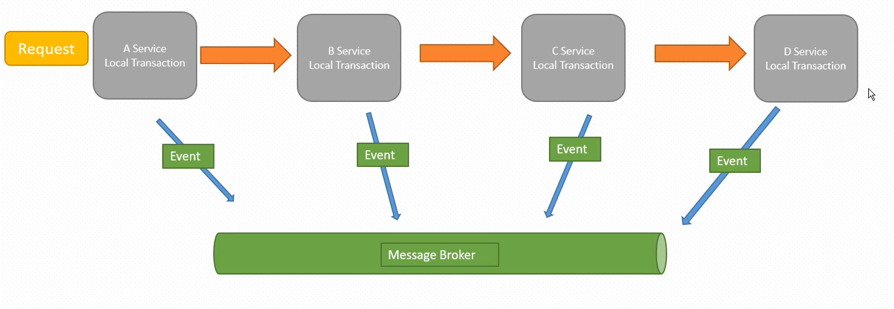
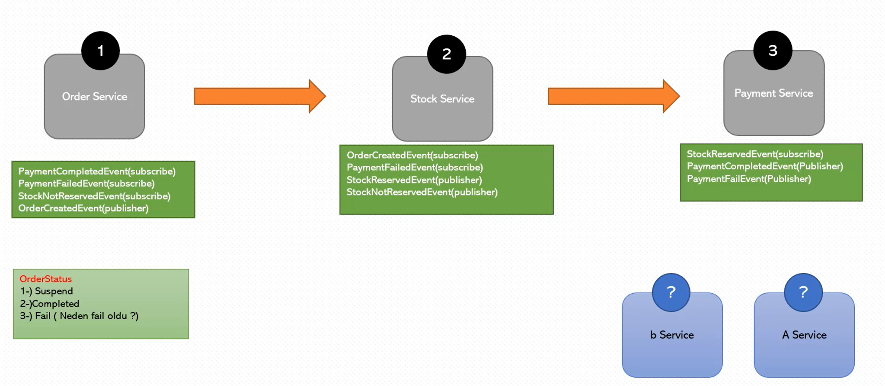
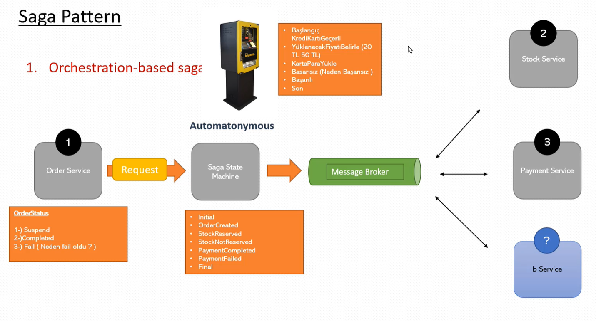

## ACID
Atomicity: Do all or do nothing

Consistency: Consistency between data

Isolation: Transactions should be isolated from each other

Durability: Data should be stored safely

## RabbitMQ
- Publish:
    
    - Sends to Exchange
    - The message is lost if no one is listening

- Send:

    - Sends to Queue

## Saga Pattern

### Choreography-based saga

- If you have 2 - 4 microservices
- No central transaction manager. Therefore no performance bottleneck
- Uses a message broker system for async communication 
- Every service listens to message queue to take the necessary action and also sends action result to the queue 
- Local transaction order is used for transaction management
- Uses compensable (rollback transaction) transactions
  

### Orchestration-based saga

- Uses a central transaction manager which may cause performance bottleneck
- If you have more than 4 microservices
- Uses async messaging pattern
- All transactions are managed by a central manager (Saga State Machine)
